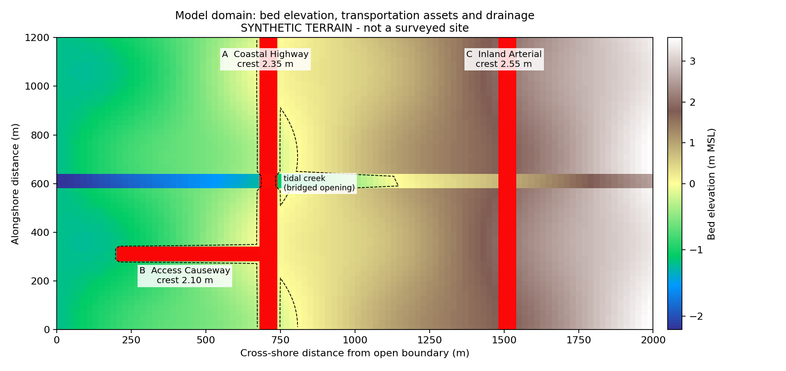
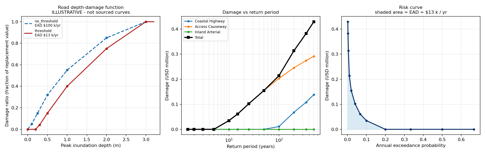
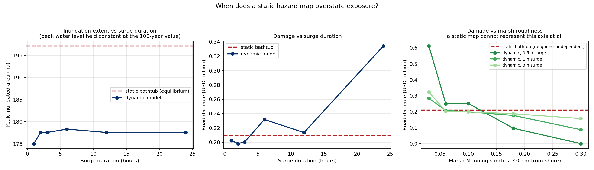

# Coastal flood risk assessment for transportation infrastructure

A 2D hydrodynamic inundation model built from the governing equations, coupled to
asset-level depth-damage functions and integrated to expected annual damage.

Storm surge forcing → 2D shallow water hydrodynamics → peak inundation depth over
specific road assets → depth-damage function → expected annual damage → asset ranking.

**Anthony Ariu Abu** · Ibadan, Nigeria · self-directed, 2026



---

## What is real and what is not

| Component | Status |
|---|---|
| Hydrodynamic solver | Written from the governing equations; verified against four analytical cases |
| Surge distribution | **Fitted** — GEV on 46 annual maxima, NOAA CO-OPS station 8418150 (Portland, Maine), 1980–2025 |
| Terrain and road network | **Synthetic** — geometrically plausible, not a surveyed site |
| Unit costs | **Illustrative** |
| Depth-damage curve | **Illustrative** — shape is plausible, ordinates are not sourced |
| Tide amplitude | **Assumed** (1.40 m) — not taken from the published station datums |

Provenance is printed at runtime. Nothing here should be quoted as a result about
anywhere.

---

## Method

The **local-inertial** approximation of the 2D shallow water equations — advective
acceleration dropped, which is standard for floodplain and coastal overland flow and is
the scheme underlying LISFLOOD-FP.

Momentum per unit width, semi-implicit in friction:

```
                q^n  −  g · h_flow · Δt · ∂(h+z)/∂x
q^(n+1)  =  ────────────────────────────────────────────
             1  +  g · Δt · n² · |q^n| / h_flow^(7/3)
```

Staggered (Arakawa C) grid, adaptive CFL timestep, and a volume-based flux limiter so
a cell can never export more water than it holds.

Two elevation fields are maintained separately: **bed elevation** governs conveyance,
**deck elevation** governs damage. At a bridge these differ by metres. Conflating them
inflated expected annual damage by a factor of 2.7 (see Findings).

---

## Verification

| Test | Expected | Result |
|---|---|---|
| Closed flat basin | Level surface, exact conservation | Volume error 0.0000%, surface flat to 2.6 mm, mean depth exactly as predicted |
| Closed tilted basin | Level surface, exact conservation | Volume error 0.0000% |
| Sloping shore, fixed sea level | Fills to sea level; shoreline where bed = SWL | Converged to 0.6001 m against 0.600 m target; shoreline within one cell |
| Dry-bed dam break | Bounded, monotone, conservative | Volume error 0.0000%; depths stay within bounds |

The dam-break front underpredicts the Ritter analytical solution (570 m vs 688 m at
t = 30 s). Expected — dropping advective acceleration retards the dry-bed front. It
bounds where the scheme applies: floodplain flow, not supercritical or strongly
advective flow.

Mass balance is audited on every production run. Worst error across all 12 return
periods: **0.00000%**, zero flux-limiter correction.

Run `python test_solver.py` to reproduce.

---

## Extreme value analysis

The surge distribution was originally invented; it is now fitted to observed water
levels (`fit_surge_gev_v2.R`).

Hourly observed water level minus hourly astronomical prediction gives the residual.
NOAA predictions reference the 1983–2001 tidal epoch, so the residual carries
accumulated sea level rise as well as meteorology — the annual mean residual is
therefore removed year by year, leaving meteorological surge.

**Two independent validations:**

- The slope of the *removed* offset is a local sea level rise estimate: **+2.83 mm/yr
  (p < 0.0001)**. Not fitted to anything — it falls out of the datum handling.
- The hand-rolled MLE was cross-checked against the `extRemes` package, which returned
  **+0.6900, +0.1353, −0.1319 — identical to four decimal places**.

| | Invented (v1) | Fitted (v2) |
|---|---|---|
| Location | 1.05 m | 0.6900 m |
| Scale | 0.38 m | 0.1353 m |
| Shape | 0 (Gumbel assumed) | −0.1319 (bounded tail) |
| 100-yr surge | 2.80 m | **1.16 m** |

No trend in annual maximum surge (+1.09 mm/yr, p = 0.53), so a stationary GEV is
defensible over this window.

---

## Results

**Expected annual damage: $13,210/yr against $6.88 M exposure.**

| Asset | EAD | % of asset value per year |
|---|---|---|
| Access Causeway | $12,388 | 0.77% |
| Coastal Highway | $822 | 0.03% |
| Inland Arterial | $0 | 0.00% |

The causeway carries **94% of the risk on 23% of the exposure**. Ranking by asset value,
or by damage in the 100-year event, would have prioritised the highway instead — the
highway takes more damage in a rare event, but the causeway floods every few years, and
expected annual damage is dominated by frequency rather than severity.



---

## Findings

**1. The damage curve outweighs the hazard model.** Holding hydraulics completely fixed
and changing only the depth-damage curve moved expected annual damage by a factor of
**7.6**, while 100-year damage moved by 3.9. Frequent shallow events dominate the
probability integral, so the least-constrained part of the vulnerability model drives
the headline number. Refining the hydraulics further is misallocated effort while the
damage curve is uncalibrated.

**2. Conflating hydraulic and structural elevation inflates risk ~3×.** The first
working version read water depth over the channel bed as water depth on the carriageway,
so a bridged crossing appeared severely damaged in events whose surge never approached
its deck. Separating the two fields moved EAD from $539,930/yr to $196,827/yr with no
change to the hydraulics. A general trap wherever assets are rasterised onto a DEM.

**3. Tide timing dominates storm size in a macrotidal setting.** Across the entire
1.5-to-500-year range the peak still water level spans only **0.59 m**, because tidal
amplitude (1.40 m) exceeds surge at every return period. Whether an asset floods depends
largely on whether a storm coincides with high water. This model assumes coincidence —
the conservative case — but a defensible assessment would treat tide–surge timing as a
joint probability, and that choice plausibly matters more than any refinement of the
hydraulic scheme.

**Bonus: static maps are adequate here, but only because the basin equilibrates fast.**
Holding peak water level fixed and varying surge duration, the static bathtub result is
within a few percent for surges of 2 h and longer, and overstates damage by ~26% at 1 h.
Marsh roughness cuts damage 58% for a 0.5 h surge but 19% at 3 h — friction sets the
filling rate, not the equilibrium level. A bathtub calculation cannot represent that
axis at all, so any assessment of marsh as natural coastal protection requires a dynamic
model.



---

## Running it

```bash
pip install numpy scipy matplotlib
python test_solver.py       # verification, ~10 s
python analysis.py          # 12-event ensemble, ~5 min
python duration_study.py    # sensitivity studies, ~5 min
```

Figures and tables are written to `outputs/`. Paths resolve relative to the scripts, so
it runs from any directory. Set `FLOOD_OUT` to redirect output.

The ensemble is cached. The cache is fingerprinted against the terrain, roughness, deck
elevations, forcing parameters and return periods — change any of them and it discards
the cache and re-runs rather than silently mixing stale hydraulics with new terrain.

For the extreme value analysis, run `fit_surge_gev_v2.R` in R. It downloads directly
from the NOAA CO-OPS API and requires no packages beyond base R.

---

## Files

| File | Contents |
|---|---|
| `solver.py` | Local-inertial 2D shallow water solver with flux limiter |
| `test_solver.py` | Four verification cases with known answers |
| `terrain.py` | Synthetic domain, dual elevation fields, asset inventory |
| `damage.py` | Surge hazard, depth-damage curves, EAD integration |
| `run_event.py` | Single-event driver |
| `analysis.py` | Return-period ensemble, damage curve sensitivity, figures |
| `duration_study.py` | Static vs dynamic, duration and roughness sensitivity |
| `fit_surge_gev_v2.R` | Extreme value analysis of NOAA gauge records |
| `METHODS.md` | Full write-up, including limitations |

---

## Limitations

- Terrain, road network and unit costs are synthetic
- Depth-damage curve ordinates are not sourced, and per Finding 1 this dominates the uncertainty
- Tide amplitude is assumed, not taken from published station datums
- Tide and surge peaks assumed coincident (conservative, not expected)
- Sea level rise is removed from the surge distribution and is **not** added back into still water level anywhere
- Wave setup, wave overtopping, rainfall and groundwater are not modelled
- Local-inertial scheme omits advective acceleration — invalid for supercritical flow
- Direct asset damage only; no traffic disruption or network-detour cost, which for transportation infrastructure is usually the larger share of total economic impact
- One deterministic run per return period; no uncertainty propagation through the damage function
